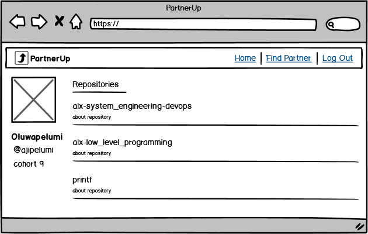
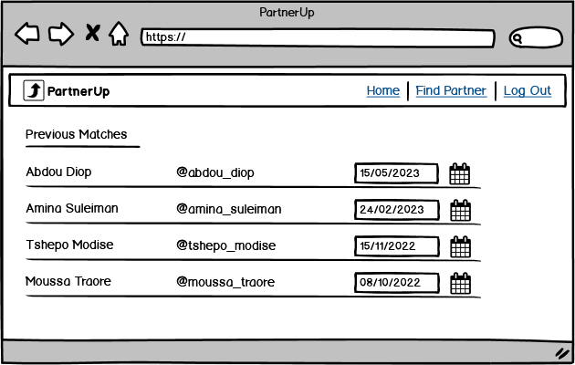

## Table of Content 📋
- [About PartnerUp](#about-partnerup)
- [Getting Started](#getting-started)
- [Demo](#demo)
- [Technologies](#technologies)
- [APIs and Methods](#apis-and-methods)
- [Future Features](#future-features)
- [Known Bugs](#known-bugs)
- [Blog Post](#blog-post)
- [Authors](#authors)
- [Acknowledgement](#acknowledgement)

## About PartnerUp 🖋️
**[PartnerUp](https://partnerup.ddnsfree.com)** is a web application designed to address the challenges faced by ALX students in finding suitable project partners.
We understand that collaborating on projects can be a daunting task, with students often struggling to find compatible partners who share their coding style and work ethic.
This can lead to frustration, unproductive experiences, and subpar project outcomes.

The mission is to simplify the process of finding project partners by leveraging the power of the GitHub platform.
PartnerUp provides a seamless login experience, allowing users to authenticate themselves with their GitHub credentials.
Once logged in, users gain access to a range of features and tools to enhance their project collaboration.

Our web application is specifically designed for ALX students, providing them with a dedicated platform to connect with potential project partners.
PartnerUp is accessible to every student with a GitHub account and an internet connection, regardless of their location.
By bringing students together and fostering productive collaborations, we believe PartnerUp will contribute to the growth and success of ALX students in their software engineering journey.

PartnerUp is more than just a project partner matching service.
It's a community-driven platform that aims to empower students, enhance project outcomes, and cultivate a culture of originality and collaboration.
Join us on this exciting journey, log in with your GitHub account, and revolutionize the way you find project partners at ALX!

## Getting Started 🌠

Using PartnerUp is simple and efficient. After logging in with their GitHub account, users can navigate to the find partner section.

Here, they can specify their preferences for project partners, such as commits, or other criteria.

Our application then analyzes coding styles, commits, and repositories to filter potential partners based on the user's preferences. This tailored approach helps students find suitable project partners quickly and easily.

Users will also have access to previous matches made by our application.

## Demo 📹
Here is a GIF demonstrating the usage of PartnerUp:

[Webpage](https://partnerup.ddnsfree.com)

## Technologies 🧑‍💻
- **Libraries**
    - Flask: web framework for Python
    - PyGithub: library for interacting with the GitHub API using Python
    - Jinja2: template engine for Flask
    - jQuery: front-end library for CSS and JavaScript
    - SQLAlchemy: high-level tools for working with databases
    - MySQLdb: python interface for connecting to a MySQL database
    - Matplotlib: plotting library for Python
    - Flask-Cors: Flask extension for handling cross-origin resource sharing

- **Server Software**
    - Nginx: high-performance web server and reverse proxy server
    - Gunicorn: WSGI HTTP server for Python

- **Languages**
    - Python: backend language for building the web application
    - HTML/CSS: frontend language for building the web application

- **Platforms**
    - GitHub: source code hosting platform
    - AWS EC2 Server: web application hosting platform

- **Frameworks**
    - Flask: web framework for building the web application

- **Database**
    - MySQL: open-source relational database management system
 
- **Resources**
    - GitHub API documentation: for accessing GitHub data using the API
    - PyGitHub documentation: for working with GitHub API
    - Flask documentation: for working with the Flask web framework

- **Design**
    - Balsamiq: wireframing and prototyping tool
    - Adobe Illustrator: vector graphics editor
    - Adobe Photoshop: raster graphics editor

- **Project Management**
    - Trello: project management and collaboration tool

## APIs and Methods 🔑
- **API Routes**
    - /api/users   
    POST: This route is used to submit the user's GitHub username

    - /api/users/<user_id>  
    GET: This route is used to retrieve information about a specific user  
    DELETE: This route is used to delete a specific user

    - /api/users/<user_id>/partners  
    GET: This route is used to retrieve a specific user’s partners

    - /api/users/<user_id>/partners/<partner_id>  
    GET: This route is used to retrieve a specific user’s partner  
    POST: This route is used to submit a specific user’s partner  
    DELETE: This route is used to delete a specific user’s partner

- **3rd-party API**
    - PyGitHub proved to be a valuable tool for interacting with the GitHub API, eliminating the need for direct interaction with the API itself.

## Future Features 📇
- **Enhanced Partner Matching**: Currently, the application matches users based on commits and other criteria specified in their preferences. 
In the future, additional factors such as project interests, past experience, and availability could be considered to improve the accuracy of partner matching.
This could involve incorporating machine learning algorithms or expanding the range of data analyzed from GitHub profiles.

- **Reputation and Feedback System**: Implementing a reputation and feedback system would enable users to provide feedback on their project partners' collaboration skills and performance.
This would help build a community-driven platform where users can make more informed decisions when selecting partners for future projects.

- **Advanced Search Filters**: Expanding the search functionality with advanced filters would allow users to refine their partner search based on specific criteria.
These filters could include factors such as location, or project complexity. Providing users with more granular control over their partner search would enhance the overall user experience.

- **Integration with Version Control Systems**: Integrating the application with popular version control systems like Git would enable seamless repository management and code collaboration.
Users could directly access and sync their repositories within the application, making it easier to work on shared projects and track code changes.

- **Mobile Application**: Developing a mobile application version of PartnerUp would enable users to access the platform on their smartphones or tablets.
This would increase accessibility and convenience, allowing users to search for partners, communicate, and manage projects on the go.

## Known Bugs 🐛
- **Slow Match Functionality**: The current implementation of the match functionality experiences a delay of approximately 15 seconds or more in finding a match.
This delay is caused by factors such as API response time, processing complexity, and data volume.
Addressing these factors and optimizing the match functionality is a priority for future versions of the application.
The goal is to reduce the processing time and provide users with a faster and more efficient matching experience.

- **User Experience**: Also, for the best user experience and optimal performance, te recommendation is using the application on a desktop or laptop rather than a mobile phone.
The application may have variations in user experience and performance on mobile devices. Using a larger screen will ensure better functionality and an enhanced overall experience.

## Blog Post ✍️
Following the completion of the development phase, I wrote a comprehensive blog post, documenting my entire experience throughout the project.  
    - 

## Authors 👨
**Ajisafe Oluwapelumi** - Designer & Software Engineer
- [GitHub](https://github.com/ajipelumi)  
- [LinkedIn](https://www.linkedin.com/in/ajisafeoluwapelumi/)  
- [Twitter](https://twitter.com/the_pelumi)  
- [Dev](https://dev.to/ajipelumi)  

If you have ideas for partnerup or you would like to contact [Oluwapelumi](https://www.linkedin.com/in/ajisafeoluwapelumi/), please feel free to reach out!

## Acknowledgement 🌟
- ALX Staff & Students  
- Holberton School Staff & Students  
- Abdulqadir Ahmad  
- Olagunju Abraham  
- Durojaiye Oladipupo  
- Durojaiye Dickson  
- You
