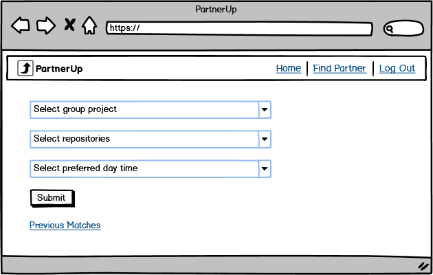

## Table of Content
- [About PartnerUp](#about-partnerup)
- [Getting Started](#getting-started)
- [Technologies](#technologies)
- [APIs and Methods](#apis-and-methods)
- [Authors](#authors)
- [Acknowledgement](#acknowledgement)

## About PartnerUp
**PartnerUp** is a web application designed to address the challenges faced by ALX students in finding suitable project partners.
We understand that collaborating on projects can be a daunting task, with students often struggling to find compatible partners who share their coding style and work ethic.
This can lead to frustration, unproductive experiences, and subpar project outcomes.

The mission is to simplify the process of finding project partners by leveraging the power of the GitHub platform.
PartnerUp provides a seamless login experience, allowing users to authenticate themselves with their GitHub credentials.
Once logged in, users gain access to a range of features and tools to enhance their project collaboration.

Our web application is specifically designed for ALX students, providing them with a dedicated platform to connect with potential project partners.
PartnerUp is accessible to every student with a GitHub account and an internet connection, regardless of their location.
By bringing students together and fostering productive collaborations, we believe PartnerUp will contribute to the growth and success of ALX students in their software engineering journey.

PartnerUp is more than just a project partner matching service.
It's a community-driven platform that aims to empower students, enhance project outcomes, and cultivate a culture of originality and collaboration.
Join us on this exciting journey, log in with your GitHub account, and revolutionize the way you find project partners at ALX!

## Getting Started

Using PartnerUp is simple and efficient. After logging in with their GitHub account, users can navigate to the partner search section.

Here, they can specify their preferences for project partners, such as skill levels, commits, or other criteria.

Our application then analyzes coding styles, commits, and repositories to filter potential partners based on the user's preferences. This tailored approach helps students find suitable project partners quickly and easily.

Users will also have access to previous matches made by our application.

## Technologies
- **Libraries**
    - Flask: web framework for Python
    - PyGithub: library for interacting with the GitHub API using Python
    - Requests: library for making HTTP requests using Python
    - Jinja2: template engine for Flask
    - jQuery: front-end library for CSS and JavaScript
    - SQLAlchemy: high-level tools for working with databases
    - MySQLdb: python interface for connecting to a MySQL database

- **Languages**
    - Python: backend language for building the web application
    - HTML/CSS: frontend language for building the web application

- **Platforms**
    - GitHub: source code hosting platform
    - AWS EC2 Server: web application hosting platform

- **Frameworks**
    - Flask: web framework for building the web application

- **Database**
    - MySQL: open-source relational database management system
 
- **Resources**
    - GitHub API documentation: for accessing GitHub data using the API
    - Flask documentation: for working with the Flask web framework

## APIs and Methods
- **API Routes**
    - /api/users
    GET: This route is used to retrieve users
    POST: This route is used to submit the user's GitHub username

    - /api/users/<user_id>
    GET: This route is used to retrieve information about a specific user
    DELETE: This route is used to delete a specific user.

    - /api/users/<user_id>/partners
    GET: This route is used to retrieve a specific user’s partners

    - /api/users/<user_id>/partners/<partners_id>
    GET: This route is used to retrieve a specific user’s partner
    POST: This route is used to submit a specific user’s partner
    DELETE: This route is used to delete a specific user’s partner

- **3rd-party API**
    
    https://api.github.com
    - GET /users/{username}: Retrieve information about a specific GitHub user.
    - GET /users/{username}/repos: Retrieve a list of repositories owned by a specific GitHub user.
    - GET /repos/{owner}/{repo}: Retrieve information about a specific GitHub repository.
    - GET /repos/{owner}/{repo}/commits: Retrieve a list of commits made to a specific GitHub repository.

## Authors
### Ajisafe Oluwapelumi
[GitHub](https://github.com/ajipelumi)  
[LinkedIn](https://www.linkedin.com/in/ajisafeoluwapelumi/)  
[Twitter](https://twitter.com/the_pelumi)  
[Dev](https://dev.to/ajipelumi)  

Oluwapelumi is a full-stack software engineer working on both the front-end and back-end of this project.
Working on PartnerUp is a significant milestone in Oluwapelumi's career as it represents the culmination of the last one year of dedicated learning, practical experience, and a relentless pursuit of excellence in ALX software engineering program.
It's also an opportunity to make a meaningful impact on the lives of ALX students by solving a real problem they face: finding suitable project partners.

If you would like to contact [Oluwapelumi](https://www.linkedin.com/in/ajisafeoluwapelumi/), feel free to reach out!

## Acknowledgement
ALX Staff & Student  
Holberton School Staff & Student  
Abdulqadir Ahmad  
Durojaiye Oladipupo  
Durojaiye Dickson  
Areola Daniel  
